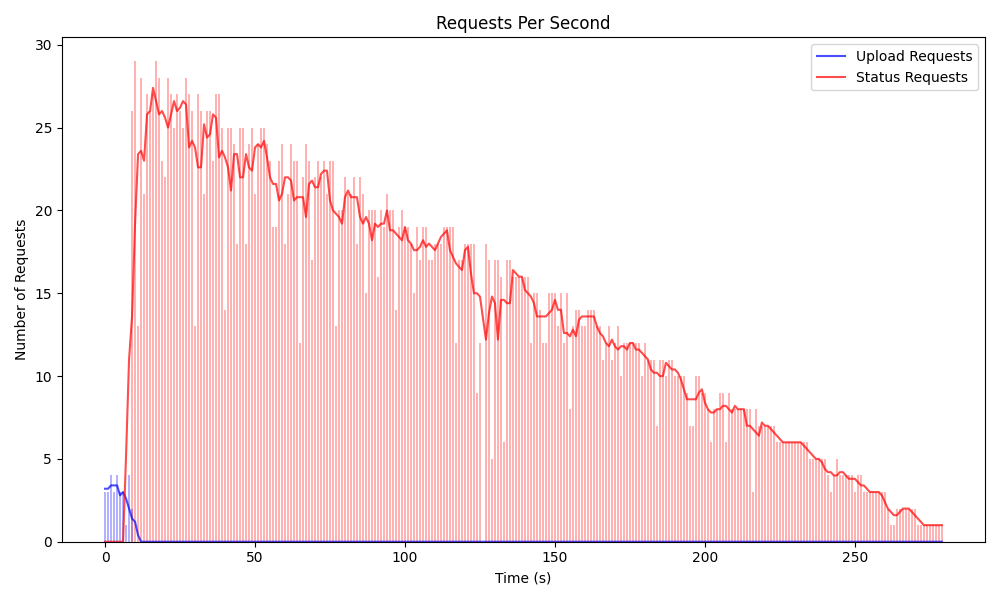

## Предметная область
Система для извлечения ключей шифрования из файлов рукопожатий WPA2. 

### Архитектура сервиса
Архитектура сервиса состоит из нескольких компонентов, взаимодействующих через RabbitMQ для обмена сообщениями:

1. API-сервер (app.py):
   - Предоставляет HTTP-интерфейс для загрузки файлов рукопожатий и проверки статуса обработки.
   - Обрабатывает загрузку файлов и сохраняет их в общей директории.
   - Отправляет запросы в очередь RabbitMQ для дальнейшей обработки.

2. Очередь (worker.py):
   - Управляет очередью задач и состоянием обработки рукопожатий.
   - Хранит информацию о рукопожатиях в базе данных SQLite.
   - Обрабатывает запросы от API-сервера и отправляет задачи на обработку.
   - Отслеживает прогресс и результаты обработки.

3. Сервис обработки (processor.py):
   - Выполняет фактическую работу по извлечению ключей из файлов рукопожатий.
   - Использует инструменты hcxpcapngtool и hashcat для конвертации и взлома паролей.
   - Отправляет обновления о прогрессе и результатах обратно в очередь.

4. RabbitMQ:
   - Служит в качестве брокера сообщений между компонентами системы.
   - Обеспечивает асинхронное взаимодействие и распределение задач.

5. База данных:
   - SQLite используется для хранения информации о рукопожатиях, их статусе и результатах обработки.

### Процесс работы системы:
1. Пользователь загружает файл рукопожатия через API.
2. API-сервер сохраняет файл и отправляет запрос в очередь.
3. Очередь добавляет задачу в базу данных и, при возможности, отправляет ее на обработку.
4. Сервис обработки получает задачу, выполняет извлечение ключа и отправляет обновления о прогрессе.
5. Очередь обновляет информацию о прогрессе и результатах в базе данных.
6. Пользователь может запрашивать статус обработки через API.

### Технологический стек

1. Flask - веб-фреймворк для API
2. RabbitMQ - брокер сообщений для асинхронной обработки
4. SQLite - легковесная база данных для хранения информации о задачах
5. SQLAlchemy - ORM для работы с базой данных

Брокер сообщений необходим, так как он позволяет эффективно распределять нагрузку при обработке множества файлов рукопожатий WPA2, особенно в периоды пиковой активности, например, для масштабного теста корпоративных Wi-Fi сетей. Вместо увеличения мощности серверов для обработки, RabbitMQ позволяет буферизировать запросы и равномерно распределять их между доступными обработчиками. Выбор RabbitMQ обусловлен его надежностью, простотой интеграции и возможностью легко масштабировать систему, добавляя новые обрабатывающие узлы без изменения основной архитектуры, что критично для потенциального роста сервиса по взлому Wi-Fi паролей.

## Нагрузочное тестирование

### Принцип тестирования

Для проведения нагрузочного тестирования используется библиотека асинхронных HTTP запросов "Aiohttp". Создается несколько процессов, каждый из которых отправляет большое количество запросов на загрузку файлов и получение их статуса. Получение статуса файлов длится до тех пор, пока все файлы не будут иметь статус "processed".

### Результаты тестирования

На графике видно, что в первую минуту тестирования происходит отправление запросов на обработку файлов, и резкий рост запросов на получение статуса файлов. С каждой итерацией количество запросов на получение статуса понижается линейно с тем, как сервис парсинга обрабатывает файлы. Спустя 5 минут после запуска тестирования обработка всех файлов
завершается.

## Заключение

В ходе данной работы была разработана система из следующих компонентов: API-сервер для загрузки и отслеживания файлов, очередь задач для управления и мониторинга состояния, сервис обработки для выполнения фактического извлечения ключей с использованием hcxpcapngtool и hashcat, а также базу данных SQLite для хранения информации о задачах. Компоненты взаимодействуют через RabbitMQ для асинхронной обработки и обмена сообщениями. Тестирование системы с использованием Aiohttp показало, что сервис способен эффективно справляться с высокой нагрузкой, распределяя задачи равномерно и обеспечивая своевременное обновление статуса обработки.